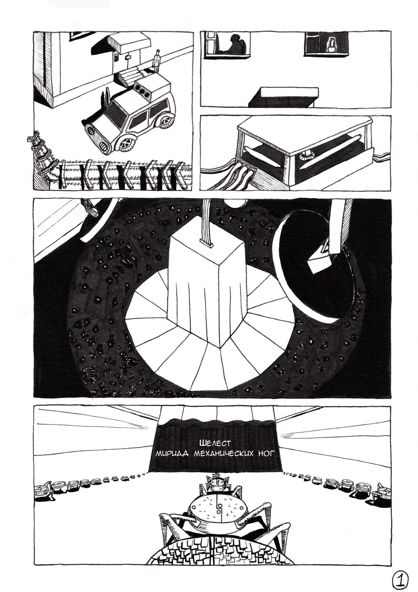

  

    <button class="comic-viewer__button" id="comic-prev" type="button">← Назад</button>
    <select class="comic-viewer__select" id="comic-select" aria-label="Выбор страницы"></select>
    <button class="comic-viewer__button" id="comic-next" type="button">Вперёд →</button>
    
1 / 18

  

  
Стрелки клавиатуры тоже работают.

  <figure class="comic-viewer__frame">
    
  </figure>

