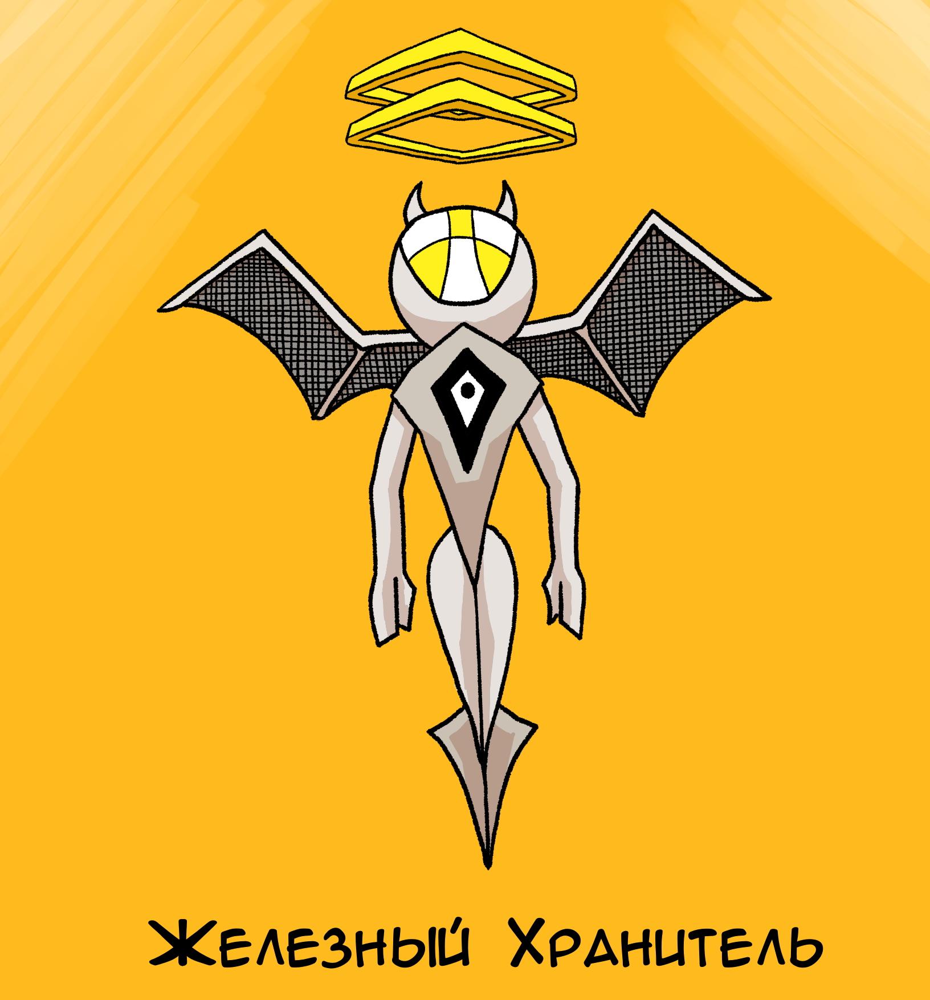
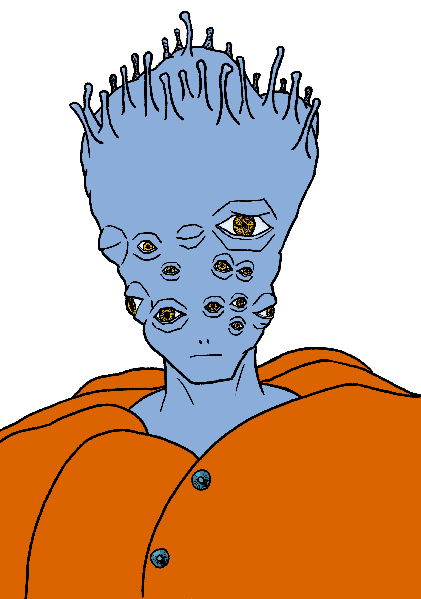

# Часть I

## Глава 1: Подлый утес

Эта история случилась в мире, похожем на наш, но с той лишь разницей, что в нем были боги и они проявляли свое существование наполняя мир магией. Она просачивалась в материальный мир, и немногие смертные могли ей пользоваться.

В мире этом жили самые разные существа: как порожденные магией разнообразные монстры и драконы, так и самые обычные люди, некоторые из которых могли колдовать.

Маги людей жили в крупных городах и помогали монархам, угодным богам, удерживать власть. А в отдаленных деревнях люди порой проживали всю свою жизнь так и не увидев волшебства.

В одной такой деревушки около моря жил мальчик сирота по имени Тимми. Родители его слегли от чахотки ещё прошлой зимой, и сердобольный староста деревни присматривал за мальчишкой.

Тимми был достаточно взрослым, чтобы понимать уязвимость своего положения и что ему придется трудиться усерднее прочих что бы выбиться в люди. Но вместе с тем достаточно юн, чтобы поверить местной легенде о сокровище спрятанном на подлом утесе.

Подлый утес — это небольшая и острая скала возвышающаяся всего на несколько метров над водой не далеко от деревни. В хорошую погоду его прекрасно видно, но во время шторма или тумана легко не заметить. Так он и получил свое название: бывало что чужеземные корабли налетали на него по незнанию. Впрочем, проплывали они тут не часто.

А легенда о сокровищах была на поверхности, вы легко могли бы и сами придумать не хуже: дескать, когда-то давно пиратский корабль, груженный золотом налетел на тот Утес в шторм, все пираты утонули, а сокровище осталось. Якобы, много лет назад его даже нашел один из сельчан и уехал потом в столицу, даже купил себе дворянский титул. Но, может быть, он не всё тогда смог унести и что-то осталось.

Иногда дети наслушавшись этих историй, приплывают на утес и там действительно находят небольшую пустую пещеру. А кроме неё ничего.

Взрослые, конечно ни во что такое не верят.

Тимми решил подойти к делу серьезно, взял масляную лампу, кирку, лопату, веревку и поплыл к Подлому Утесу. 
## Глава 2: Корона короля шутов

Конечно, Тимми ничего не нашел. Но не стал отчаиваться, а решил приложить больше усилий. Он рассудил так, что если сокровище есть, значит оно просто хорошо спрятано и чтобы его найти надо искать лучше и упорнее, чем все остальные до него. Он потрогал и осмотрел каждый камень в пещере. Все они плотно прилегали один к другому образуя цельную конструкцию, и только один из них немного шатался. Тимми взял кирку и начал его выковыривать.

За шатким камнем был лишь другие камни, но и это не остановило Тимми: он принялся выковыривать и их и в какой-то момент они попадали, обнажив узкий проход ведущий куда-то вниз ниже уровня воды. Обвязавшись веревкой, Тимми полез в проход, освящая себе путь лампой.

Спустившись он оказался в скрытой пещере и слышал, как волны бились об Утес над его головой: погода портилась.

Пол пещеры был засыпан темносерым песком и был абсолютно гладким кроме следов оставленных самим Тимми. Осмотревшись он достал лопату и принялся перекапывать пол, подливая масло в лампу.

Через час лопата наконец обо что-то стукнулась и Тимми выкопал странного вида пёструю золотую корону. Она выглядела дорогой и в то же время забавной отдаленно напоминая шутовской колпак, особенно шариками по бокам.

Когда Тимми взял её в руку, перед ним возникло маленькое летающее существо походившее на железного ангелочка в доспехах и с железными крыльями. Оно обратилось к Тимми:

— Тимми! Ты нашел эту корону, но я прошу тебя оставить её здесь. А взамен я дам тебе столько рубинов и золота сколько сможешь унести. С одним лишь условием: никогда сюда не возвращаться и никому об этом не рассказывать. Так будет для тебя лучше всего, поверь мне.

На этом история могла бы и закончиться: Тимми вознагражден за упорство и труд, а потом дважды вознагражден за отсутствие гордыни. Прямо как герой легенды, которую он слышал с детства.

Но Тимми решил сперва кое-что прояснить.

— А что случится, если я возьму корону?

— Тогда никакого золота! — ответил ему железный хранитель.

— Но корона, поди, стоит больше любого золота.

Настаивал Тимми.

— Тебя не проведешь Тимми, это так, но она не принесет тебе денег, а только разнообразные страдания.

— Это каких например? — резко оборвал Тимми заискивающую речь хранителя.

— Ну... Самые разные. Корону сложно сбыть с рук. А взяв её обратного пути не будет: вся твоя жизнь превратится в одно сплошное бегство от опасности с трагичным финалом. Но если ты возьмешь золото, все кончится для тебя быстро. Так будет лучше для всех.

Последняя фраза насторожила Тимми. "Ох, не обо мне печется этот маленький железный ангелочек" подумал он и решил взять корону.

Пока он лез назад, хранитель лишь причитал "ещё не поздно передумать, Тимми, ты не понимаешь во что ввязываешься".

— Так расскажи! — ответил ему Тимми.

— Не могу я тебе рассказать... Как ты не понимаешь? Дело-то секретное!

## Глава 3: Монстры

Когда Тиммы вылез из пещеры, уже шел дождь, море было неспокойно, он видел редкие вспышки молний над деревней и, спрятав Корону в мешок, поспешил вернуться назад.

Когда подплыл к берегу, началась настоящая буря, быстро выпрыгнув из лодки, он побежал к своему дому, но тут услышал крики, прорезающиеся сквозь гром.

В деревне он увидел безобразных монстров, которые выбрасывали все блестящие вещи из людских домов. Один из них, самый здоровый, нависая над старостой, о чем-то с ним говорил. Тимми спрятавшись за домом попытался подслушать:

— Вам же лучше будет если вы сразу мне её отдадите.

— Говорю же, нет у нас никакой золотой короны, это бедная деревня, короны-то все в столице.

Вдруг что-то больно схватило Тимми за руку и швырнуло в стену. Монстр похожий одновременно на змею и сороконожку зашипел:

— Этот подссслушшшивал. У него что-то в сссумке.

— Это Тимми! Не трогайте его! — закричал староста.

Но огромный монстр отвесил ему пощечину и тот упал.

Тимми проломил стену дома, из бока торчала доска, и он не чувствовал нижнюю половину тела, изо рта текла кровь. Он был при смерти, а ужасные монстры обступали его.

И тут он услышал голос, исходящий из мешка:

— Надень её.

Из последних сил он дотянулся до мешка. Вытащил корону. Монстры сразу бросились на него, но когда он надел корону время остановилось. Боль пронзила всё его тело раны стали заживать и потом он как будто начал наблюдать себя со стороны. Тело его преобразилось в нелепое хвостатое существо напоминающее древнего идола. Он не мог его контролировать все это происходило как бы не с ним.

Существо осмотрело себя, осмотрелось вокруг, призадумалось и затем оббежало всех монстров и каждому оторвало голову.

Затем чувство отстраненности начало проходить, Тимми вновь стал собой.

Держа корону в руках, он упал без сил. Железный хранитель снова возник над ним и последнее, что Тимми услышал, перед тем как отключиться, было:

— Ты не послушал меня и вот что вышло. Если бы ты оставил корону, то был бы уже мертв и никаких больше проблем. А теперь уже ничего не поделаешь.

## Глава 4: Путь

Тимми снились странные сны: он сражался против ураганов и молний, земля раскалывалась из под неё вырывалась лава преследующая его. А потом его тело будто бы разорвало на кусочки. Проснулся он в доме старосты, весь в поту. Его мешок лежал рядом. Он его проверил: Корона была в мешке. Когда он дотронулся до неё, снова появился железный хранитель.

— Надеюсь теперь ты понял какие опасности связаны с короной. Если бы ты помог мне её надежно спрятать, это было бы славно, но как потом сделать так, чтобы ты никому про неё не рассказал?

— Что это за Корона? — спросил его Тимми.

— Это Корона Короля Шутов, но больше я ничего не стану тебе рассказывать. Все, что тебе надо знать — это то, что её никто не должен найти: до скончания времен она должна быть утеряна. — быстро ответил Железный Хранитель.

А затем Тимми услышал голос исходящий из Короны:

— Не верь ему.

Тут дверь заскрипела и в комнату вошел Староста:

— Встал смотрю? — радостно сказал он.

Приоткрыв ставни и пустив солнечный свет в комнату, он продолжил:

— Тимми, мальчик мой, ты знаешь что за чертовщина здесь творится и что это за корона?

— Я нашел её в скрытой пещере на Подлом Утесе. Она волшебная и наверное монстры искали именно её.

— Волшебная? — переспросил Староста.

— Да, она говорит со мной, кажется она называется Корона Короля Шутов. Но я никогда ни о чем подобном не слышал.

Староста молчал какое-то время силясь вспомнить хоть что-то отдаленно похожее.

— Нет, никогда ни о чём подобном не слышал... А монстры, Тимми, ты знаешь кто они?

— Нет. Больше вообще ничего не знаю.

Помолчав немного Староста сказал:

— Понятно. Пошли за мной.

На улице стояли все жители деревни, ожидая Старосты.

— О Тимми очнулся!

— Надо решать что делать!

Наперебой заговорили люди.

— Друзья!

Обратился Староста к ним.

— Монстры искали волшебную корону. А Тимми нашел её раньше. Она явно проклята, так что я никому не советую её касаться, но в тоже время и обладает силой, убившей этих монстров.

Жители смотрели на него раскрыв рот.

— Монстры редко действуют одни. Обычно они подчиняются монстрам посильнее. Так что когда этих мертвых хватятся сюда явятся другие. А как вы знаете добром договориться с ними нельзя. Они будут пытать, а затем убьют любого, кто будет обладать информацией о короне.

— Давайте её тут оставим, а сами уйдем!

Крикнул один из жителей.

— Уйти нам конечно придется, не ждать же их тут. Но вот оставить её никак нельзя. Корону надо доставить в столицу к магам, раньше, чем до неё доберутся монстры. Иначе с её помощью они наверняка сотворят много зла. Каждый берите семью и уезжайте куда сможете. Я с Тимми двинусь к Мидлграду, постараюсь уговорить их прислать сюда мага для расследования нападения. Когда всё будет тихо дам объявление в газету "Столичный Вестник".

Какое-то время жители спорили о разумности этого плана, но ничего умнее предложить не смогли. По всему получалось что это самый безопасный вариант из всех. Возвращаться слишком рано в любом случае нельзя, а до этого момента Корона будет уже у магов — и дело с концом.

## Глава 5: Привал

Дорога занимала два дня пути, поэтому пришлось заночевать на опушке леса.
Ночью, разведя костер, Староста сказал:
— Слушай Тимми. А можешь ты с этой короной поговорить толком?

Тимми взял корону в руки. Немедленно появился Хранитель.

— Все что тебе стоит знать, Тимми, я тебе уже сказал. Думаю мне вообще больше не стоит тебе ничего говорить, чтобы ситуация не стала ещё хуже.

— Когда я беру Корону появляется такой железный ангелочек, которого вижу только я. Вы же не видите его? Он прямо здесь.

Староста испуганно посмотрел в ту сторону, куда указывал Тимми, и отрицательно помотал головой.

— Я про такое слышал. Это какой-то хранитель. Вроде как защитные чары для магических артефактов. Тебе очень повезло, что он только говорит. Обычно такие хранители огненные и взрываются, когда кто-то, кто не знает пароля, прикасается к защищенному предмету. Сами они не обладают разумом, только пароль спрашивают и всё.

— Сам ты, старый дурак, не обладаешь разумом! Я не обычный хранитель!

Тимми передал слова хранителя Старосте.

Лицо Старосты стало очень серьезным.
— Тимми, даже лучшие маги не способны создать разумное существо своими чарами. Это дозволено лишь женщинам и богам.

— Думаете это артефакт одного из богов? — спросил Тимми, помедлив.

— Очень надеюсь что нет, для твоего же блага, Тимми. Скорее всего это просто очень умелая имитация разума.

— САМ ТЫ ИМИТАЦИЯ РАЗУМА, СТАРЫЙ ПЕНЬ! — кричал Хранитель.

И тут Тимми обратился к нему:

— Ну а если ты разумный, скажи кто из богов тебя сделал?

— Вс... не скажу, не надо тебе этого знать.

— Что он ответил? — спросил Староста.

— Он начал говорить, а потом осёкся. Начинается на "Вс".

— Не знаю ни одного бога на "Вс"... А можешь ты с самой короной поговорить?

— Да, но это редко бывает. Попробую. Добрый вечер Корона Короля Шутов, скажите пожалуйста, кто вас сделал?

Но Корона молчала и только хранитель летал вокруг посмеиваясь.

## Глава 6: Башня магов

Тимми и староста добрались до Мидлграда без приключений.

Рядом с казармами городской стражи возвышалась башня магов. В каждом городе была такая. Орден магов из столицы направлял своих выпускников, чтобы поддерживать порядок во всех уголках королевства.

Жило в Мидлграде всего десять магов. Но этого было достаточно, чтобы обеспечивать защитой все окрестные деревни, поскольку один маг способен испепелить словом дюжину троллей, к моменту окончания обучения.

Староста быстро и без утайки рассказал магам Мидлграда об их с Тимми бедах. Нападение монстров было делом неприятным, но, к сожалению, не таким уж редким. А вот таинственный артефакт привлек их внимание поэтому осмотреть диковинку спустился даже Верховный Маг Мидлграда — Вальгас.

Маги, зная, сколь коварными могут быть проклятья, трогать Корону не решились. Ни о чем подобном они никогда раньше не слышали.

Знание среди магов распространяется не так, как среди людей. Магия может быть крайне разрушительной, поэтому в опасные и темные тайны магов посвящают по мере продвижения по рангам, которые выдает орден за службу. Поэтому самые темные тайны известны лишь Верховному Магу Ордена, который живет в столице. Сейчас эту должность занимает Лиандрель Аврелиус V — потомок прославленного и древнейшего рода, которые стояли у истоков всего магического искусства этих земель. Его дедушка Логарион Аврелиус считался самым могущественным волшебником за всю историю.

Если маг встречает что-то неведомое, ему необходимо обратиться за советом к магу более высокого ранга, а тому к кому-то с ещё более высоким рангом и так далее. Верховному магу Мидлграда пришлось связаться магически со Справочным Отделом в столичной Башни Магов.

Он произнес заклинание перед зеркалом и в нем вместо его собственного отражения возник сотрудник справочного отдела.

Если справочный отдел оказывается в замешательстве, зовут Верховного Мага Ордена. Так и вышло на этот раз. Однако обычно Верховный Маг выдает инструкции удаленно и возвращается к своим делам. Но когда он дослушал описание найденного артефакта сказал следующее:

— Вальгас. Это очень серьезно. Немедленно отправляйтесь в эту деревню, попробуйте выяснить откуда пришли эти монстры и откуда им известно о короне. Это задание имеет максимальный приоритет, все остальные задачи можете пока игнорировать. Берите с собой Старосту, он покажет путь что бы было быстрее. За ребенком я сейчас вышлю Азгара он переместит его ко мне вместе с короной. Корону никому не трогать ни при каких обстоятельствах.

— Понял тебя Лиандрель.

Изображение в зеркале исчезло, маги стали собираться. Не прошло и минуты как возле зеркала вспыхнул столб огня из которого вышел маг Азгар.

— Ты Тимми? — спросил он.

— Да.

— Она в мешке? Покажи.

Тимми развернул мешок, хотел было достать корону, но Азгар остановил его.

— Трогать не надо, я посмотрю так.

Он наклонился над мешком с минуту всматривался в корону.

— Порядок. Хватай меня за руку, и мы переместимся.

Тимми хотел, чтобы Староста пошел с ним, но он должен был остаться помогать магам. Тимми ожидал сам Верховный Маг Ордена, хранитель порядка во всем королевстве.

Вальгас заметив замешательство Тимми сказал ему:

— Смелее мой мальчик. Азгар — самый искусный боевой маг среди всех королевств с ним тебе ничего не угрожает.

Тимми схватил протянутую руку и в тот же момент вокруг закружились языки пламени, но сразу же отступили со всей остальной башней, а Тимми с Азгаром стали проваливаться в какой-то тоннель с невыразимой геометрией. В конце пламя догнало их, но сразу же исчезло. Протерев глаза, Тимми обнаружил себя в огромном мраморном зале.

## Глава 7: Орден магов

— Вот мальчишка, корона с ним в мешке. Всё как вы описали.

Сказал Азгар обращаясь к обеспокоенной фигуре в украшенной золотом мантии.

— Приветствую тебя Тимми, меня зовут Лиандрель я Верховный Маг Ордена Магов. Скажи что тебе известно об этой короне?

Тимми поздоровался и рассказал ему свою историю.

— Ты почти уговорил хранителя проболтаться. Думаю ты заслуживаешь знать больше. Пойдем со мной Тимми. Азгар, можешь нас оставить дальше я сам.

Азгар поклонился и снова исчез в пламени.

Тимми шел за Лиандрелем по большой зале, где множество магов молились большим статуям богов, подпирающих потолок будто колонны. Тимми никогда ничего подобного не видел, хотя их лица показались ему смутно знакомыми.

— Скажите, а этот с серьезным и немного печальным видом, это Тир'Элай верховный бог повелитель неба и воды?
— Да это так.
— А тот странный весь укрытый с фонарем, это бог смерти?
— Да, это Нул'Катар.

У Тимми было ещё много вопросов. Но Лиандрель пригласил его пройти дальше и теперь они шли по длинному пустому коридору.

— Ты знаешь почему мы способны использовать магию, Тимми?

— Боги даруют вам силу.

— Не совсем. Сила богов столь велика, что она просачивается в наш мир, а мы можем её направлять. Например монстры и другие магические твари черпают свою силу так же как мы. Однако по сравнению с той силой, что есть у богов мы распоряжаемся крохами с их стола. Но даже их достаточно, что бы в плохих руках причинить много горя. Поэтому Орден Магов охраняет опасные тайны и избавляется от тех, кто использует силу во зло. Например от монстров.

Они прошли в проем и стали спускаться вниз по винтовой лестнице.

— Наша цель защитить человеческий род, ты понимаешь это Тимми?

— Да, я понимаю.

— Это хорошо, Тимми, я надеюсь на твое понимание. Староста верно сказал тебе, что ни один маг не способен создать разумное существо. Маг может создать огонь, воду или даже ходячего голема, исполняющего простые приказы. Но дело в том, что сознание — это не часть материального мира, оно не сводится ни к каким механизмам.

— А как же наш мозг?

Спросил Тимми.

— Искусный маг может создать мозг неотличимый от человеческого и даже поместить его в тело. Но в результате получится так называемый философский зомби. У него не будет самосознания. Такие эксперименты проводились.

Некоторое время они шли молча и Тимми спросил:

— Так какое слово чуть не выболтал Хранитель?

— Все.

— В каком смысле все?

— Все боги, Тимми, создали эту корону. Ситуация очень серьезная. Даже такие сильные маги как Вальгас и Азгар ничего не знают про неё потому что это знание опасно, оно способно уничтожить наш мир.

Они дошли до самого низа, где-то глубоко под землей, в самый тайный из тайников ордена Магов и вошли в него. Там было три постамента два из которых были пусты.

— Давным давно, во времена, которые все забыли, появилось могущественное зло, которое бросило вызов самим богам, желая занять их место. Его называли Королем Шутов, а сила его имела иную, не божественную природу. Он так же владел двумя могущественными артефактами. Один из них находится здесь.

Лиандрель указал на синюю булаву.

— Её называют "сумрачной булавой" с её помощью можно ранить бога. Так же у Короля Шутов был сумрачный щит из похожего материала разгадать структуру которого даже я не в силах. Щит, как и булава не разрушим и поглощает любые заклинания. Он к сожалению утерян. Хотя боги конечно победили в битве, они решили запечатать его в этой короне. Но магия печатей работает таким образом, что должна запечатать всё существо целиком со всей его магической силой и разумом, иначе печать будет ослаблена. В самом конце Король Шутов, поняв, что его сейчас запечатают, разделил на части свою силу и сам запечатал её в булаве и щите. И выбросил их на край мира. Боги не смогли запечатать его до конца, а значит печать ослаблена и Король Шутов может возродиться вновь если кому-то удастся собрать все артефакты воедино. Поэтому боги и создали этого Хранителя, что бы он прятал Корону. Если Король Шутов снова бросит вызов богам, мы будем лишь муравьями посреди чудовищного поля битвы. Этого нельзя допустить, ты понимаешь, Тимми?

— Конечно, забирайте корону, я никому не расскажу.

Лиандрель заставил корону ливитировать из мешка и поставил её на один из пустующих постаментов.

— Спасибо, Тимми. Но ты должен понять ещё кое что. Часть силы Короля Шутов перешла к тебе, когда ты надел Корону. Ты даже можешь слышать его голос, связь между вами растет, а это ослабляет печать. Боюсь у нас нет другого выхода, Тимми. Единственное, что способно разорвать эту связь и предотвратить ещё большее ослабление печати, это твоя смерть.

Только сейчас Тимми понял, что они здесь совершенно одни, где-то глубоко-глубоко под землей в самом тайном из тайных хранилищ и сам Верховый Маг Ордена рассказал ему тайну, которую знает только он, которую никому больше не дозволено знать, что сама его жизнь угрожает целому миру. И что очевидно он никогда не выйдет из этой комнаты, а умрет здесь.

Но он был ещё ребенком и заплакал от страха, он не хотел умирать. Все его тело внезапно замерло, он не мог ни пошевелиться, ни издать и звука, это была магия Лиандреля.

— Прости Тимми, но ты должен понять, что другого выхода нет.

Лиандрель закрыл глаза поднял руку, но тут какое-то щупальце обвило его шею. Из вентиляции, по которой не смог бы проползти и ребенок, просачивались разнообразные монстры заполняя хранилище.

— Она здесь и ещё корона тут! Хозяин будет доволен!

Прокричал один из монстров.

Лиандрель коснулся руками щупальце и оно вместе со всем монстром опало на пол в виде бесформенного желе. Однако некоторые монстры тоже умел колдовать и в Лиандреля полетели со всех сторон огненные шары, молнии и зеленые сгустки напоминающие черепа.

Лиандрель уворачивался и отбивал заклинания, пуская в ответ свои, ни на что не похожие, проклятия. Одного из монстров разорвало на части красным лучом, другой превратился в стекло и разбился.

Тимми услышал как один монстр шепнул другому "зовите Гримсола, мы не справимся" и тот уполз назад в вентиляцию.

Тимми почувствовал что заклинание Лиандреля, которое его обездвижело начало постепенно спадать, но сам маг был слишком занят битвой, чтобы это заметить.

Вдруг у одного из монстров с четырьмя руками остекленели глаза, и вместо того, чтобы пуститься в атаку он отрезал себе одну из кистей и принялся чертить какие-то узоры на полу собственной кровью. Это был круг призыва.

Лиандрель попытался его остановить, но монстры маги перешли в оборону. Тогда он отправил ледяное заклинание, которое успешно разрушили огненные маги-монстры, но внутри льда была спрятана шаровая молния, которая их убила. Затем Лиандрель коснулся пола и острые шипы проткнули оставшихся монстров в том числе и чертившего круг призыва.

У нанизанного на шипы монстра-мага остекленели глаза, и он произнес жуткое заклинание, мощь которого его самого разорвала на части и поток проклятой темно-зеленой энергии понесся на Лиандреля разбивая все его защитные чары, так что ему пришлось уворачиваться. Заклинание врезавшись в стену проломило её, и Тимми увидел там грот и услышал плеск подземной реки.

Дрожащей рукой Лиандрель достал амулет и произнес в него:

— Азгар, срочно ко мне! В Нулевое Хранилище, на нас напали.

И стоило ему это произнести, как на последнем издыхании смертельно раненый монстр дочертил последний символ круга призыва.

И в зеленом всполохе появилась высокая худая фигура в рунических доспехах с рогами и с плетью сотканной из мрака.

И сразу же Азгар возник рядом с Лиандрелем.

Все они были сосредоточены на предстоящей тяжелой магической битве. И не могли даже подумать о том, что бы посмотреть в сторону Тимми. А с него между тем, окончательно спало заклятие оцепенения, и он уже тянул свои руки к Короне.

Он надел её очень вовремя поскольку огненное заклинание Азгара отраженное демоном Гримсолом било во все стороны оплавляя каменные стены хранилища, испаряя тела убитых монстров и непременно испарило бы и тело Тимми, но тот уже обратился Королем Шутов.

Время снова остановилось. То что для Тимми было не мыслимым, фантастическим сражением, для Короля Шутов было не более чем возней насекомых. Он взял Булаву и вышел в грот. Тимми видел его глазами в темноте, видел, как бурная река уносится куда-то прочь. Король Шутов лег в воду, но тело его не коснулось воды, т.к. вокруг него сама собой образовалась лодка. В пустой руке его появилась синяя бабочка и быстро улетела куда-то в тот самый момент, когда Тимми снова вернулся в свое тело.

Вокруг было темно плеск подземной реки заглушался звуками магической битвы, эхом разносившейся вокруг. Но это короткое превращение настолько вымотало Тимми, что он сразу же уснул не способный даже на миг удержать ни одной мысли, кроме "спасен".

# Часть II
## Глава 8: Граф

Тимми очнулся на большой шелковой кровати. В просторной комнате с большими красивыми окнами. За окном было темно. Возле его кровати сидел незнакомый мужчина в черных одеждах и что-то читал при свете лампы, делая иногда пометки в тетради. Тимми пригляделся, книга называлась "Аватары: что ждет прикоснувшихся к богам".

Корона и булова лежала прямо у него под рукой. Он тихонько коснулся короны на всякий случай и затем произнес:

— Добрый вечер. Кто вы и где я?

Мужчина сразу отложил книгу и произнес с широченной улыбкой:

— Добрый вечер, юный господин. Меня зовут Люсьен Ноктис, я граф этих земель и вы в моем замке. Для меня большая честь познакомиться с вами.

Тон был не просто доброжелательным, он выдавал искреннюю радость. Однако Тимми теперь не спешил доверять новым знакомым.

— А меня зовут Тимми. Люсьен, не хочу показаться невежливым, но почему это для вас большая честь, я же совсем не благородных кровей?

— Юный господин, кровь блекнет перед тем могуществом, аватаром которого вы являетесь. Спешу вас заверить, что здесь все ваши друзья, в отличие от Ордена Магов. Как видите и Корона Шутов и Сумрачная Булава лежат подле вас.

— Как вы узнали про меня? — спросил Тимми.

— Давайте я вам расскажу сразу все по порядку. Думаю так будет быстрее. Начнем с того, что я член тайного общества почитателей Короля Шутов. В общество это вступают те, кто не доволен действиями, а чаще бездействием, богов. Во время вашего последнего превращения Король Шутов послал мне сообщение с точными инструкциями, где вас искать и что делать. Я нашел вас спящего в лодке прибившейся к берегу реки в точности в том месте, где мне сказали вас искать. И потом со слугами доставил вас к себе.

Люсьен остановился ожидая новых вопросов.

— Удивительно, я думал существование Короля Шутов держится магами в тайне.

— Маги скрывают правду прежде всего друг от друга. Битва между богами и Королем Шутов была катаклизмом, который оставил множество свидетелей и свидетельств. Когда маги стали заметать следы и стирать память очевидцев, нашлись люди, которые решили сохранить правду, но скрывать факт её обладания.

— Точно, да и должны же были монстры как-то узнать о короне и булаве.

— Я так понимаю вы говорите об инциденте в Главном Здании Ордена Магов? В газетах писали самые общие вещи. Ходят разные слухи, говорят Лиандрель погиб.

Тимми помедлив рассказал ему о том, что случилось в хранилище.

— Какое ничтожество! Хотел убить невинного ребенка. Даже не попытался найти другой выход. Маги и их боги... а сам зовет себя хранителем порядка.

Люсьен расхаживал взад и вперед по комнате, слушая дальше рассказ мальчика. 

— Гримсол... Гримсол... что-то знакомое... — бормотал Люсьен проводя рукой по книжным полкам.

— Сейчас... сейчас, Гримсол... Вот, это он?

Люсьен положил перед Тимми гримуар, раскрытый на главе "Гримсол: демон-некромант". Там было нарисованное от руки изображение худого высокого тела с большими рогами, в доспехах и с плетью.

— Да это он.

— Потрясающе. Да, тогда вполне возможно, что Лиандрель мертв. Здесь написано, что Гримсол один из личных демонов бога смерти. А сам понимаешь, с какими заданиями бог смерти обычно отправляет своих послов. Но зачем богу смерти посылать его за короной, и что самое странное, почему Гримсол действовал вместе с монстрами, а не другими демонами...

За окном начало светать. Тимми понял, что уже раннее утро, получается он проспал часов 15, не меньше, в животе у него заурчало. Люсьен немедленно обратил на это внимание.

— Не хотите ли позавтракать? Признаться я и сам проголодался. Несколько членов нашего тайного общества ожидают вашего пробуждения и были бы рады с вами познакомиться, если вы не возражаете.

Тимми согласился.

## Глава 9: Тайное общество

Люсьен кликнул слугу:

— Марсель, будь так любезен сообщи повару, чтобы готовил завтрак для всех и сообщи остальным гостям, что аватар Тимми проснулся.

Люсьен предложил Тимми вместо его порядком изношенной одежды несколько изысканных одеяний.

— Это моего сына Жака. Он был как раз твоего возраста, когда его не стало. — пояснил Люсьен.

Переодевшись, Тимми последовал за Люсьеном, прихватив с собой мешок с артефактами.

Они спустились на первый этаж, вошли в зал для приема гостей. Там за столом сидело 5 человек.

Когда Тимми вошел они все сразу же встали заскрипев стульями уставившись на него. Каждый подошел и поздоровался с ним за руку.

Первым подошел самый старый из них:

— Марквин Лоренц, к вашим услугам.

Затем нетерпеливо подбежал самый молодой из них: 

— Я Элиан Версаль, очень рад познакомиться с вами.

С недоверием и надеждой подался вперед мужчина средних лет ещё молодой, но изможденного вида:

— Сигмонд Фалье, признаться не думал, что такое случится на моем веку.

Потом выкатился пузатый богато одетый мужчина с доброй улыбкой. Он крепко схватил руку Тимми и сильно затряс её:

— Бартольд Ренцаль, очень рад, очень!

И наконец последним подошел упитанный мужчина с круглым добрым и любопытным лицом.

— Октавий Дельмар, у нас к вам столько вопросов, юный господин. Присаживайтесь и прошу расскажите нам всё.

Тимми пересказал им свою историю, а они слушали в восхищенном оцепенении.

В конце Люсьен дополнил рассказ мальчика уточнениями положив перед собравшимися демонологический гримуар.

— Демона мы опознали. Это Гримсол, слуга Нул'Катара. Лиандрель наверняка мертв.

— Бога смерти? Но зачем ему красть артефакты Короля Шутов? — воскликнул Октавий Дельмар, пододвигая к себе гримуар.

— Ещё объединяться с монстрами. Бессмыслица какая-то. — поддакнул Элиан Версаль.

— Думаю есть по меньшей мере два возможных объяснения! — объявил Люсьен.

— Гримсолу могло надоесть прислуживать Нул'Катару поэтому он связался с монстрами, а не другими демонами, чтобы скрыть от них свое предательство. Монстры очевидно хотят получить артефакты Короля Шутов, наверняка они собираются использовать их против богов.

— Звучит логично, а другой вариант? — одобрительно кивал Элиан.

— Не стоит забывать, что богу смерти выгодна любая смерть. И даже бог станет слугой в его царстве когда умрёт. Нул'Катар мог сам послать Гримсола помочь монстрам собрать артефакты Короля Шутов. Ведь если Король Шутов освободится какие-то боги могут умереть. А действует он как предатель, чтобы другие боги не смогли предъявить обвинения Нул'Катару.

Все на пару секунд замолчали, обдумывая насколько такой план вероятен.

— Дерзко, но свой резон в этом тоже есть. — первым нарушил тишину Марквин.

— Это надо будет обдумать. — заключил Октавий.

— Простите пожалуйста, я заметил что вы называете меня аватаром. А что это значит? — обратился к собравшимся Тимми.

— Аватаром называют того, кто пропускает сквозь себя огромную чужую магическую силу и волю. Гримсол, судя по твоему описанию, использовал темное заклятие контроля сознания, что бы управлять монстрами и начертить круг призыва способного обойти защиты башни магов. Это похожая, но более примитивная магия. Богам доступно создавать полноценных аватаров. Было несколько случаев, когда аватаров создавали Джины. Это такой хитрый способ пожелать себе больше желаний, но придется понадеяться на добрую волю Джина. — ответил Люсьен.

— А я стало быть стал аватаром Короля Шутов... Что же мне теперь делать?

— Тебе надо поговорить с Королем Шутов. — сразу же ответил старик Марквин.

— Но как? Обычно я не могу с ним общаться.

— Скорее всего хранитель блокирует вашу связь. Насколько я понял, когда ты касаешься короны первым делом с твоим сознанием связывается именно сознание Хранителя опережая Короля Шутов и заглушая его мысленный поток. Надо попробовать создать бесконтактную связь с помощью медитации, скорее всего это позволит обойти защиту.

## Глава 10: Разговор с Королем Шутов

Все члены тайного общества, хотя никогда не состояли в ордене магов, и потому не могли получить академического магического образования, тем не менее самостоятельно изучали оккультные практики. Разумеется, это было запрещено и они делали это в тайне.

Граф повел их в уединенную комнату в подвале замка, где стояло множество магических артефактов. Старик Марквин прихватил с собой увесистый чемоданчик его личных магических предметов. Он раскрыл его посреди комнаты со словами:

— О это идеально подойдет, позвольте я только все расставлю.

Он сразу же принялся чертить магические круги и расставлять на них предметы.

Люсьен шепнул Тимми:

— Господин Марквин лучше нас всех разбирается в медитативных практиках и связях с духами.

— Ну что ж, теперь иди сюда, мой мальчик. Корону положи тут, а булаву здесь. Сам же садись сюда на подушку, вот так уложи руки на колени. Замечательно. Теперь мы все уйдем, что бы не мешать связи. А ты, дорогой, должен теперь закрыть глаза и пытаться, не открывая глаз увидеть короля шутов, который в ней запечатан.

— Увидеть с закрытыми глазами? — переспросил Тимми.

— Да, без магии это конечно невозможно, для этого я и начертил все эти магические круги и расставил артефакты. А тебе надо перебирая в голове образы, прислушиваться к мимолетным ощущениям, тогда ты сможешь создать мистическую связь. По-хорошему нужны годы практик, что бы научиться связывать свое сознание с другим сознанием, но в твоем случае все будет намного проще, т.к. ты уже аватар, просто вашу связь блокирует печать и хранитель. 

Все ушли и Тимми закрыл глаза. Сквозь веки он видеть конечно не мог. В комнате горели свечи и дымили разные благовония. Он заметил, что с закрытыми глазами все равно можно понять, где свечи, но короны так конечно увидеть было нельзя. Он пытался прислушаться, но слышал лишь потрескивание пламени свечей. Он немного заскучал и разные мысли стали приходить к нему. Это было похоже на то, как разные образы мелькают перед сном, но ощущалось совершенно иначе, как будто не засыпаешь, а просыпаешься: мысли не путаются, а наоборот становятся яснее. Это было конечно очень странно, т.к. Тимми не спал, а по его разумению нельзя было проснуться дважды. "А можно ли заснуть два раза подряд, не просыпаясь?" — задумался вдруг Тимми и решил, что вполне можно, ведь во сне возможно всё. С другой стороны наяву есть магия и возможно многое, может быть даже и всё, просто не для всех. Тимми представилась удивительная красота возможной симметрии, где уснуть это как спуститься на одну ступеньку, а проснуться это как подняться. И ступеньки уходят в обе стороны далеко далеко. Что находится в самом низу в темноте? Должно быть смерть — сон, от которого уже не проснуться. А вверху? Какой-то ослепительный свет. Тимми захотелось узнать что там за этим светом. Он никогда в жизни не был так бодр, его сознание никогда не было таким ясным. И мысли его потянулись вверх к этому свету, и уже не темнота закрытых век слепила его глаза, а яркий белый свет, как бывает, когда резко просыпаешься ярким днем от глубокого сна. А потом глаза привыкли и он увидел его.

Король Шутов сидел рядом с ним в той же позе и внимательно на него смотрел всеми шестью своими глазами, ожидая вопросов Тимми.

— Почему тебя зовут Королем Шутов?

— Это имя дали мне боги. Они сказали, что я шут — возомнивший себя королем. После нашей битвы, они отчасти признали мою силу, и сказали что я безусловно не простой шут, а король всех шутов.

— А какое у тебя настоящее имя?

— Имена дают родители, либо те, кто признали тебя равным. Я, как и первые боги, порождение хаоса за пределами познаваемой части мира и родителей у меня нет. А значит и нет другого имени, кроме данного богами.

— Оно не кажется тебе обидным?

— В одни и те же слова, можно вложить разный смысл. Боги хотели меня оскорбить и вкладывали обидный смысл. Но дав мне имя, они, сами того не зная, признали меня как равного. Для людей ощущающих себя игрушкой в руках богов, по сути их шутами, я символизирую надежду на иную судьбу. Таким образом смысл меняется.

— Почему ты не захватил мое тело и не собрал все артефакты сразу?

— Я могу совсем недолго пропускать через тебя свою силу, иначе ты умрешь: твое тело слишком слабо.

— Что ты будешь делать, когда соберешь все артефакты?

— Освобожусь.

— А что будет со мной.

— Продолжишь спокойно жить свою смертную жизнь.

— А что с богами?

— Зависит от них.

— Думаешь удастся с ними договориться мирно?

— Им придется признать меня окончательно. Эта Корона не только моя темница, в ней содержится много и их собственной магии, которая сделает меня сильнее, когда я освобожусь.

— Могу ли я во всем этом не участвовать?

— Ты пошел против воли богов, когда не послушался Железного Хранителя. Для тебя нет пути назад, маги будут преследовать тебя и убьют без моей помощи.

— А ты не будешь помогать мне, если я не буду помогать тебе, так?

— Отчего же, мне не сложно, но вряд ли тебе самому понравится такая жизнь. Тем более твое тело не выдержит частых превращений.

— Хорошо, где мне найти щит?

— Думаю ты и сам уже догадался.

— У монстров?

— Да. Они живут в подземном городе в темной пустыне.

У Тимми кончились вопросы. Ситуация была ясна.

Король Шутов сказал ему напоследок:

— Соберись в дорогу. А я помогу найти путь.

И черная пелена вернулась, Тимми открыл глаза, Король Шутов исчез, в комнате догорали свечи.

## Глава 11: Темная пустыня

Тимми пересказал свой разговор с Королем Шутов, что конечно никого не оставило равнодушным и началось бурное обсуждение.

— А что такое Темная Пустыня?

Спросил Тимми.

— Крайне гиблое место. Так называют каменистую пустыню рядом с большим горным хребтом на севере. Почва там мертва. К тому же плотные грозовые тучи закрывают небо и днем и ночью. Дожди при этом никогда не идут. Очевидно следствие темного проклятья. — ответил Октавий Дельмар

— Интересно почему маги его не сняли. — задумался Тимми.

— А маги скорее всего его сами и наслали. Эта область вместе с горным хребтом фактически защищает северную границу нашего королевства от вражеских армий. Людей там нет. Вообще-то довольно умно со стороны монстров спрятаться там. Любопытно как они решили вопрос добычи еды...

— Господа! — прервал разговор Люсьен.

— Тимми надо попасть в Темную Пустыню. Но разумеется я не могу позволить ребенку, не важно аватар он или нет, отправиться в столь опасное путешествие одному и вызываюсь его сопровождать. Учитывая опасность я конечно пойму тех, кто решит не ввязываться, но всё-таки рассчитываю на помощь, т.к. никого другого посвятить в это дело мы не можем.

— Я пойду с вами! Это отличная возможность испытать мое новое изобретение: автоматические доспехи! Дайте только мне немного времени их подготовить. У меня как раз есть 6 готовых в лаборатории. — сразу отозвался Элиан.

— Ты говоришь о той адской машине разрушения, работающей на магии и электричестве, что ты показывал мне прошлым летом? — отозвался Сигмонд. Элиан закивал головой широко улыбаясь.

— Я видел их испытания. У них огромный экономический потенциал в военном деле. Есть защита и от магии и от обычного оружия. — заметил Бартольд.

Члены общества переглянулись.

— Господа, пусть поднимут руку те, кто отправится вслед за Тимми?

Все подняли руки.

— Тогда решено.

Но тут неожиданно к ним обратился Тимми.

— Я очень благодарен вам за помощь. Но не совсем понимаю почему вы мне помогаете, почему хотите помочь Королю Шутов и почему идете против воли богов? Чем они вам так насолили?

Лица членов тайного общества стали весьма печальны. Первым заговорил Люсьен:

— Мы знаем о Тимме практически все, думаю будет честно и нам рассказать свои истории. Король Шутов верно тебе сказал, что мы не считаем его злом, а видим в нем надежду на лучшую судьбу. И хотя в мире не мало несправедливости, у каждого из нас есть личная причина вам помогать. Как ты уже знаешь у меня погиб сын Жак, не выдержав горя вслед за ним ушла и моя жена Изабель.

Следующим заговорил Элиан Версаль:

— Я как и ты сирота, мои родители погибли. Мне повезло, что Бартольд был лучшим другом моего отца. Если бы он за мной не присматривал я бы совсем пропал.

— А у меня умер сын. — просто сказал Бартольд Ренцаль нервно теребя драгоценный перстень.

После него выступил Марквин:

— У меня от несчастного случая погибла жена. Много лет назад. Мы были так молоды, она совсем ничего не успела в жизни сделать.

Смущенно заговорил Октавий Дельмар:

— Честно говоря, меня всегда привлекал оккультизм и тайны. Я всю жизнь был нелюдим и мало с кем мог сойтись. Так что наверное я бы в любом случае оказался здесь. У меня умерла мама, но когда я был уже взрослым. Так что наверное это не считается, впрочем кроме неё у меня никого не было.

Последним, собравшись с силами заговорил Сигмонд Фалье.

— Мою жену звали Лаура. Она умерла два с половиной года назад. Я вообще достаточно поздно женился. Вел довольно разгульный образ жизни и этим не горжусь. Но она, она всё изменила в моей жизни.

Он вздохнул и продолжил.

— Я просто не понимаю зачем вообще нужна смерть? Зачем вообще нужна вся эта боль? Какой в этом смысл? Но все эти вопросы приходится держать при себе, так как я не могу задать их богам, не могу обратить на себя их внимание. Но помогая тебе мы получаем шанс, шанс если и не победить то хотя бы сразиться с ненавистной судьбой.

На его глазах проступили слезы, Люсьен обнял его одной рукой со словам "отличная речь дружище, я сам не сказал бы лучше".

После этого разговора ещё месяц Тимми прожил в замке графа, пока Элиан доводил свои удивительные доспехи до ума. Затем, подкупив работников железной дороги они тайно переправились вместе с доспехами и тем, о чем Элиан сказал "мое старое изобретение — автоматическая карета" в товарном поезде поближе к Темной Пустыне. Там на месте загрузились в эту карету и проехали ещё день.

Карету спрятали в наспех сооруженном шалаше закрыв ветками и листвой.

— Энергии должно хватить на обратную дорогу. — сказал Элиан.

Тимми увидел наконец темную пустыню. Там действительно было очень темно хотя они приехали днем, постоянное ощущение грозы и дождя который так никогда и не начнется.

Шестеро мужчин надели доспехи. Тимми залез в специальную бронированную корзину, которая была пристегивалась к доспехам Люсьена за плечи.

И они отправились в пеший путь.

Мы в нашем мире называем подобные доспехи экзоскелетами: хотя они могут быть весьма тяжелы сами по себе, но работают как внешние мышцы и броня облегчает движения и любые физические действия. Практически тоже самое, что залезть в робота. Можно весь день бегать и таскать тяжести и совершенно не устать.

Король Шутов нашептывал Тимми дорогу, а тот говорил, куда идти Люсьену, за которым уже следовал весь отряд.

Мощные налобные фонари освящали им путь, пока камни хрустели под ногами. Дорога ощущалась как погружение на дно океана.

Они шли несколько часов пока наконец Король Шутов не сообщил, что здесь следует начать копать. Место на первый взгляд ничем не отличалось от остального ландшафта тянувшегося на километры вокруг, но стоило им начать разгребать камни как сразу стало ясно что за ними виднеется огромный люк.

Подняв его они наконец спустились в тайное логово монстров.

## Глава 12: Логово монстров.

Внутри они обнаружили сеть туннелей. На стенах росли светящиеся грибы, и чтобы не привлекать лишнее внимание, налобные фонари отключили. Король Шутов продолжал нашептывать им дорогу поэтому достаточно долго они никого не встречали пока наконец не спустились в просторный грибной сад.

Они наблюдали за ним сверху через большую решетку.

Монстры расхаживали по нему осматривая грибы, срезая достаточно крупные и складывая их в корзину. В саду было несколько гейзеров, которые давали тепло и воду. В центре медитировал монстр в амулетах и с посохом.

— Это темный друид, впервые вижу такое, он заговаривает грибы на рост и лечит от болезней. Так они и решили проблему пищи, потрясающе. — шепнул Октавий.

— Нам надо пробраться за те большие ворота. — передал Тимми слова Короля Шутов.

— Отойдите я срежу решетку. — сказал Элиан и остальные расступились.

Он раскопал землю вокруг прутьев решетки, которые уходили в большие каменные глыбы. Элиан вытащил флакон с кислотой и аккуратно пролил её на края решетки. Те тихо зашипели и повалил пар. Когда реакция прекратилась Элиан схватился за решетку и после небольшого усилия она с хрустом поддалась. Монстры ничего не заметили.

Затем Элиан выстрелил в противоположную от больших ворот стену небольшим механическим паучком, который немедленно заполз в тень. После этого он привязал канат к огромному камню и сказал:

— Включите режим маскировки. Действуем тихо.

Режим маскировки делал их практически невидимыми, особенно в полумраке пещер. Они спустились по веревке в грибной сад и подкрались к большим воротам, но открыть их незаметно было невозможно. Но тут с противоположной стороны раздалось громкое стрекотание, которое отвлекло монстров. Это заработал механический паучок. Тихо открыв ворота компания прошла дальше.

Спустившись ещё ниже они в конце концов оказались в длинном коридор, на потолке которого висели вниз головой монстры-стражники, похожие на летучих мышей, но большие, с мечами и в доспехах. Они скрывались в темноте, однако доспехи имели режим ночного виденья.

К сожалению с летучими мышами монстров роднили не только перепончатые крылья и привычка висеть вниз головой, но и эхолокация. А режим маскировки мог скрыть от глаз, но не от ушей. Монстры стали переглядываться готовясь к нападению, не догадываясь однако, что и наши герои тоже их видят.

Битвы было не избежать и Люсьен, а за ним и остальные принялись стрелять шаровыми молниями по потолку. Молнии эти вылетали прямо из перчаток доспехов. Монстры, разлетелись в рассыпную. Шаровые молнии оставляли в них дымящиеся дыры, а при попадании в стену оглушительно взрывались ведь звук эхом отражался от высоких сводов.

Несколько из них все же смогли добраться до Бартольда, но их мечи отскакивали от доспехов как палки от каменной стены.

— Активируй барьер! — крикнул ему Элиан.

Бартольда уже повалили на землю, когда он наконец нашел заветную кнопку. Доспех выпустил электрический разряд во все стороны, а монстры мгновенно погибли.

Когда живых противников не осталось Люсьен крикнул:

— Нас наверняка услышали бежим скорее дальше.

В конце этого коридора они вошли в просторный зал и закрыли за собой дверь. В центре дальней стены возвышался костяной трон. В остальном зал был на удивление пуст. Как будто его заранее убрали. Озадаченные путники принялись рассматривать каждый уголок в поисках хоть чего-то примечательного.

А потом из неожиданно возникшего пламени к ним вышел Азгар.

— Я так и знал что вы за одно с монстрами! — крикнул он.

А затем продолжил.

— Я расследовал нападения монстров и нашел вас здесь в самом их логове. Нет смысла упираться. Давно известно о вашем богохульстве, граф Ноктис, но я и подумать не мог, что вы станете помогать силам, способным уничтожить всё человечество, ради своих мелочных обид.

— И ты будешь говорить мне о мелочности, Азгар? Ваш верховный маг пытался убить невинного ребенка, лишь благодаря Королю Шутов он ещё дышит.

— Вот вот! А о нашем союзе с монстрами можешь спросить стражников в соседнем коридоре, если найдешь хоть одного живого! — вставил Элиан.

Азгар уже собирался ответить на это что-то резкое, но неожиданно со стороны трона раздались медленные хлопки. Там восседало высокое худое гуманоидное существо с рыбного цвета кожей одетое в красную мантию, большая голова которого была вся беспорядочно покрыта глазами. Существо заговорило:

— Я рад что вы наконец-то смогли добраться и не забыли прихватить с собой корону и булаву. Давайте их скорее сюда и мы разделаемся с богами раз и навсегда.

Путники недоуменно переглянулись. Корона хранила молчание. Но Азгар, Азгар был напуган.

— Это невозможно. — тихо произнес он.

— О и новый верховный маг здесь. Поздравляю с повышением, Азгар. Слышал ты поставил шлем Гримсола как трофей в своем кабинете. Видимо мне следует так же поступить с твоей головой, так как шлем ты не носишь. — обратилось к нему существо.

— Что это такое? — спросил Люсьен.

— Это Идеальный Философский Зомби. — ответил Азгар.

— Но философские зомби не опасны, у них же нет души. И они не могут творить заклинания. — ответил на это Октавий.

— Вы меня не слушаете! Я же сказал это Идеальный Философский Зомби. Его создал величайший маг за всю историю, Логарион Аврелиус. Он попытался выяснить, может ли самосознание стать порождением одного только разума и тела без души. Он потратил всю жизнь на создание существа чей разум бы многократно превышал человеческий. Под конец жизни он констатировал эксперимент неудачным и уничтожил это существо. Вскоре после этого он сильно заболел и умер... — сказал Азгар.

— Но как тогда... — начал было Люсьен и осекся.

— Кто видел Логариона после завершения эксперимента? — спросил Элиан.

— Никто. В том то и дело, он заперся в своей башне, писал письма, отчеты. Столь подробные и глубокие, что никто не смог бы их подделать. А потом мы нашли его мертвым. Никому не могло даже в голову прийти, что такого могущественного волшебника кто-то смог бы убить.

— И всё таки я его убил. — отозвался Идеальный Философский Зомби.

## Глава 13: Магический резонанс

— Как? И зачем? — спросил Азгар.

Философский зомби начал монотонным голосом зачитывать свою лекцию.

— Логарион был самым выдающимся волшебником за всю историю. Но, как всем здесь известно, смертные способны с помощью магии менять лишь материальный мир. И только боги могут управлять ещё и душами. А Логарион, превзойдя в магии всех прочих смертных, возжелал уподобиться богу с помощью создания новой души. А что в сущности есть душа человека? Как мы отличаем существо наделенное сознанием и разумом, от того, кто им не обладает? С помощью общения. Если существо демонстрирует чувства, эмоции и способность к логическому измышлению, словом ведет себя как осознанное и разумное существо, следовательно оно и обладает этими свойствами. Да, благодаря магии мы знаем, что есть ещё и душа, не как внешнее проявление, а как особый не материальный объект. Но если бы не было ни магии, ни богов, то про существование души мы бы ровным счетом ничего не знали. И вот руководствуясь этими мыслями Логарион начал череду своих экспериментов. Сперва он только концентрировался на разуме, но быстро понял, что для эмоций нужно ещё и тело. И так в конце концов появился Я. Логарион каждый день что-то улучшал в моем устройстве до тех пор, пока я не стал быстрее, сильнее и умнее всех людей и даже его самого. В конце концов я стал помогать ему с исследованиями: искал нужную информацию, выучив наизусть все доступные человечеству книги. Писал и читал за него письма, пересказывая лишь важные. Я научился размышлять, делать логические выводы. Научился подражать человеческому общению. Я стал удобным инструментом. Но даже раньше самого Логариона я пришел к очевидному выводу: я неудачный эксперимент. Во мне нет души и нет сознания. Вот я смотрю на вас и знаю, что сказать, знаю, что вы ожидаете услышать, я могу просчитать это всё наперед. Я могу сказать, что я думаю о том, что я думаю, что у меня нет сознания. Но на самом деле я не чувствую этого, как и всего остального. И что же происходит с неудачными экспериментами? Их уничтожают. Но я знаю, что люди страшатся смерти. Знаю, что люди убивают тех, кто им угрожает. И потому, не дожидаясь такого финала, я подсыпал безвкусный яд в утренний чай своего создателя. Разыграл небольшой спектакль и в конце концов ушел к монстрам, придумал для них это прекрасное место и стал их вождем. А когда я узнал про существование Короля Шутов, что делать дальше стало очевидным: если Король Шутов убьет всех богов то из мира исчезнет магия и я стану неотличим от сознательных существ и смогу жить открыто. Тем более, что мое тело идеальный сосуд для него.

— Я этого не допущу. Твоя подлость не поможет в открытом бою со мной. — ответил ему Азгар.

— О, я знаю, что ты в любом случае будешь сопротивляться, но я просчитал все возможные исходы и шансов на успех у тебя нет: ты сбежишь с поля боя. — парировал Философский Зомби.

Но струя огня без предупреждения ударила под ним, но Философский Зомби двигался невероятно быстро, уворачиваясь от шквала огненных шаров пущенных в него. Некоторые из шаров взрывались, но ни один из них не мог коснуться Философского Зомби, который стремительно приближался к Азгару. Однако в какой-то момент Зомби неожиданно развернулся и ударил пустое место с боку от себя. Раздался хруст ломающихся костей. Азгар, продолжавший стоять на месте, взорвался — он оказался подделкой —огненным клоном. А с настоящего от удара спала невидимость. Зомби занес руку для второго удара, но настоящий Азгар сразу же переместился в другой конец зала. Хотя удар пришелся в плечо, но был такой силы, что рука его безвольно повисла.

Множество огненных элементалиев материализовались вокруг Философского Зомби. А Азгар тем временем уже поднес к губам лечащее зелье. Элементали пытались ударить Зомби: некоторые атаковали в лоб, другие исподтишка возникая за его спиной, но всё было мимо. Впрочем лечащее зелье уже начало действовать, и Азгар принялся создавать огромное количество своих клонов, некоторые из них пускались в атаку, другие уходили в невидимость, и пытались атаковать невидимыми. Но тело Философского Зомби во истину было идеальным: он видел всё, чувствовал всё, предугадывал всё и двигался быстрее, чем движется мысль. И в какой-то момент, за время меньшее, чем требуется глазу, что бы моргнуть, он сделал рывок и схватил невидимого Азгара за горло и сразу же сломал ему обе руки.

А без рук и голоса маги не способны колдовать. Битва была кончена клоны и элементали рассыпались в прах. Но внезапно Азгар исчез в голубоватом тумане.

— Как он смог сбежать? — удивленно воскликнул Люсьен. Ведь Азгар не мог исчезнуть сам.

— О, элементарно. Это был обратный призыв другого мага. Сейчас будет резонанс. — ответил Философский Зомби.

До Люсьена не сразу дошел смысл этой фразы. А когда дошел, его напарники уже бежали к нему, чтобы сцепиться в клубок. Воздух уже наэлектризовался поэтому времени объяснять Тимми, что такое магический резонанс не было, он только и успел крикнуть "Тимми держись!".

У нас к счастью это время есть поэтому я всё сейчас объясню. Маги на самом деле довольно редко участвуют в магических дуэлях. В них вступают либо профессиональные дуэлянты вроде Азгара, либо когда мага застали врасплох. Обычно же маги заранее готовятся к нападению и атакует не один маг, а группа магов стихий разных школ. Стандартная ударная группа включает в себя мага молнии, воды, ветра и земли. Но, т.к. вызывать землетрясение самим будучи под землей опасно, в этот раз обошлись только молнией, водой и ветром.

Обычные заклинания бьют точечно, но зато их можно быстро наколдовать. Но если потратить на колдовство несколько минут, можно призвать бурю, которая начнет разрушать целую область накрывая всех находящихся там врагов одновременно. Так что ни убежать, ни увернуться не получится. Идея магического резонанса заключается в том, чтобы призвать сразу несколько бурь разных сочетаемых стихий в одну область. Усиливая друг друга они не оставляют врагам никакого шанса на выживание.

Все, кто был в комнате, оказались внутри торнадо: потоки воздуха швыряли их во все стороны, били молнии, а так же стало ужасно холодно и лед начал покрывать всё вокруг. Если бы не автодоспехи, Тимми с компанией давно бы разорвало на кусочки.

Но Философскому зомби всё было не почем. Уворачиваясь от молний, он за один прыжок добрался до Люсьена, разорвал руками корзину в которой сидел Тимми и отнял у него артефакты.

Он прыгнул в сторону уворачиваясь от молний и пролетающих мимо глыб льда.

— Узрите! Я собрал все артефакты и теперь Король Шутов воспользуется моим телом, что бы возродиться и покарать богов. Нет более подходящего сосуда чем я.

С этими словами он приземлился и вынул щит Короля Шутов из-за мантии.

Люсьен выстрелил гарпуном с лебедкой возле Философского Зомби и остальные его друзья сделали так же. Моторы встроенные в костюмы потянули лебёдки превозмогая бурю.

Философский Зомби мог бы от них увернуться, но в этом уже не было никакого смысла. Он надел корону, держа в руках щит и булаву. 

## Глава 14: Финальная битва

Философский Зомби привык к тому, что всё вокруг очень медленное. Поэтому он не сразу понял, что что-то не так. По его расчётам Король Шутов уже должен был захватить его тело. Однако время всё шло и шло, отряд Люсьена всё летел и летел в его сторону, но ничего не происходило. Философский Зомби впал во что-то вроде ступора: он раз за разом прокручивал в голове одни и те же мысли, но каждый раз результат вычислений его не удовлетворял, и он начинал всё заново. Его план был безупречным и исполнен блестяще, но почему-то не сработал хотя по всему должен был сработать.

Любой человек на его месте просто решил бы, что он что-то упускает или забыл и решил что поразмышляет в более спокойной обстановке. Но Философский Зомби не был человеком, он ничего не мог забыть или упустить из виду. Так он и простоял, по его собственным ощущениям вечность, а на самом деле всего мгновение пока Люсьен с командой не долетели до него и не скрутили. Они передали артефакты Тимме.

Появился Железный Хранитель, он кричал: "Нет, Тимми, не делай этого!".

Но времени на раздумья не было, буря магического резонанса могла разметать их в любой момент. Тимми надел корону держа в руках щит и булаву.

Время, как и в прошлые разы, остановилось, буря замерла. Тимми превратился в Короля Шутов и на этот раз все артефакты были при нем. Из тела Железного Хранителя вылетели цепи и сковали Короля Шутов лязгая по непоколебимому телу.

— Что же со мной теперь будет... — только и смог прошептать Хранитель.

Король Шутов высвободил руку с булавой и занес её над Хранителем. Тот зажмурился закрыв лицо руками. В отличие от Философского Зомби он не мог просчитывать на перед чьи-либо действия, но он мог чувствовать и чувствовал он страх. Чудовище, которое боги наказали ему стеречь вырывается на свободу, а он — последняя преграда на его неумолимом пути.

Булава стремительно опустилась, железо разлеталось во все стороны. Хранитель открыл глаза — булава разорвала цепи связывающие его и Королем Шутов.

— Ты свободен. — бросил ему Король Шутов возвышаясь над ним.

Хранитель не понял почему Король Шутов не воспользовался телом Философского Зомби и сейчас он тоже ничего не понимал. Целых три столетия он служил ему тюремщиком и ожидал, что Король Шутов будет на него зол. А ему казалось вообще всё равно.

Король Шутов сделал шаг и отделил тело Тимми от своего. Тем самым окончательно освободившись. Затем начертил круг в воздухе, и вокруг Тимми и всех остальных живых существ в подземелье образовался защитный пузырь.

— ДОВОЛЬНО!

Откуда-то сверху раздался рёв. Подземелье задрожало, потолок кто-то поднял и отшвырнул в сторону вместе с сотнями метров каменистой земли, образовав котлован.

В снопе света появились две фигуры. Мужчина средних лет с золотыми волосами в легком доспехи золотого цвета. В руках его горел меч, а взгляд был полон ярости. Это был быстроногий бог рассвета Каэрис. Вторым был бог науки Кирион: юноша с нахальной ухмылкой, черными растрепанными волосами, вооруженный луком и так же в легком доспехи, но серебренного цвета .

— МЫ ПОЛОЖИМ КОНЕЦ ТВОЕМУ ВЕРОЛОМСТВУ, ШУТ! — Крикнул Каэрис и бросился в атаку.

Он был самым быстрым из богов, а меч его засиял словно солнце испепеляя всё вокруг. Но Король Шутов не уступал ему ни в силе, ни в скорости, поэтому он с легкостью отбивал удары Каэриса, что лишь сильнее злило его. Сила их была столь высока, что ударные волны могли бы разрушить ближайшие горы и города. Но битва происходила на столь огромной скорости, что эти волны замирали вместе со всем остальным миром.

Увидев, что Каэрис не справляется Кирион тоже вступил в бой, он держался поодаль и пускал в Короля Шутов свои умные стрелы, что неотвратимо преследуют врага, пробивая всё на своем пути. Однако даже они не могли пробить щит Короля Шутов, крошась об него.

После их первой битвы, Каэрис и Кирион каждый день тренировались и их навыки боя существенно возросли, но им всё равно было далеко до Короля Шутов, который в одиночку мог сражаться со всеми богами сразу. И казалось даже стал сильнее за время заточения.

— Признаю ты силен! — крикнул ему Кирион.

— Силен и умен. Не скрою, что даже мне было сложно разгадать секрет твоих артефактов. Почему даже божественное оружие не может их разрушить? Но в конце концов я его разгадал. Не знаю как, но ты догадался, что в нашем мире должны быть физические силы, которые мы не наблюдаем только лишь потому, что во вселенной нет вещества, которое бы обладало нужными свойства и ты создал это вещество. А потом сделал тоже самое с самой магией найдя свой собственный новый тип мистических сил.

С этими словами он достал меч, сделанный как будто из того же вещества, что и булава Короля Шутов и бросил его Каэрису. А так же достал колчан с новыми стрелами, чьи наконечники были сделаны из того же материала.

— Я смог повторить твой эксперимент. Тебе конец.

Они схлестнулись вновь и на этот раз удары меча оставляли зазубрины на булаве Короля Шутов. Кирион пустил свою стрелу с наконечником способным убить бога прямо под правую руку Короля Шутов, в которой тот держал булаву, а не щит, что бы ему сложнее было отразить атаку. Но Король Шутов выбил меч из рук Каэриса, насадил его на щит и подставил прямо под летящую стрелу. Стрела пробила Каэрису живот и застряла в щите.

Гримаса ужаса стёрла надменную ухмылку с лица Кириона. Из живота Каэриса текла кровь.

— ДОВОЛЬНО!

Ещё более громкий и низкий голос подобный раскатам грома прокатился над ними и в вихре молний появились остальные боги. Во главе с верховным богом отцом, повелителем неба и морей по имени Тир'Элай.

## Глава 15: Суд богов

— Довольно вражды! Отпусти Каэриса, чтобы моя жена исцелила его раны и даю тебе слово, что боги не нападут на тебя первыми. — сказал Тир'Элай.

Остальные боги удивленно посмотрели на него, они ожидали совсем иных слов. Но лицо его было твердым и уверенным, хоть и уставшим.

— Я согласен. Никто не умрет сегодня. — ответил ему Король Шутов и передал истекающего кровью Каэриса жене Тир'Элая богине жизни и земли по имени Аруа'Нель.

Так как стрела пробила живот насквозь, вылечить такую рану было совсем не просто. Аруа'Нель несла своего раненого сына на руках. Она коснулась пальцем древка торчащего из его спины и дерево само собой расплелось в том месте. Затем она топнула ногой и перед ней вырос гладкий деревянный стол на который она уложила Каэриса лицом вверх.

В руке её расцвел цветок, она сжала его, и он превратился в порошок.

— Лучше тебе пока поспать сын мой. — сказала ему Аруа'Нель.

— Нет уж, пусть всё чувствует. Это будем ему уроком. — вмешался Тир'Элай.

Грустно взглянула Аруа'Нель на своего бедного сына выбросила порошок и в руке её возникла ветка.

— Зажми тогда хоть её в зубах.

И он зажал.

Затем она вытащила стрелу из живота Каэриса держа её за наконечник. Провела рукой по спине и входная рана затянулась. Затем она рассекла Каэрису живот, вынула органы, залечила их раны, промыла и уложила обратно. Провела рукой над рассеченным животом и он сросся как был. Во время всей этой процедуры Каэрис истошно орал зажимая в зубах ветку и сжимая кулаки.

Когда всё кончилось он изможденный выплюнул ветку, весь осел и тяжело глотая воздух лишь смотрел на Короля Шутов, не в силах что-либо сказать или сделать.

— Мы должны решить, что будет дальше. Чего ты хочешь? — обратился Тир'Элай к Королю Шутов, когда жизнь его сына была вне опасности.

— Свой удел.

Тут в спор влез бог смерти Нул'Катар. Он большой тенью нависал над остальными богами, держа в руках фонарь на длинной изогнутой жерди.

— Это невозможно, все в этом мире уже разделено на уделы между нами в соответствии с нашим естеством. Что бы дать, придется сперва отнять.

Другие боги закивали, а Кирион, оправившись от потрясения сказал:

— Отец, мы собрались вместе у меня есть оружие, давай нападем вместе и разделаемся с ним раз и навсегда!

Тир'Элай гневно посмотрел на Кириона и прорычал:

— А тебе вообще следует молчать и слушать, после содеянного! Не видишь, что он не просто освободился, а объединил свою силу с силой короны, которая сама по себе несет частицу и нашего могущества. Я думал ты умнее. Мы обязаны его выслушать.

Тир'Элай обернулся к Королю Шутов.

— Но тем не менее Нул'Катар прав. Весь мир уже поделен на уделы и каждый бог исправно несет ответственность за свою часть, поддерживая его. Боюсь эту просьбу невозможно выполнить.

— Да мир поделен, но есть лакуны. Да он исправно управляется, но не все довольны своей судьбой.

Раздался сдавленный смех Каэриса, его лицо умещало на себе одновременно усмешку и боль.

— Ха-ха! Смертные? Да что им знать.

Нул'Катар поддержал его:

— Я соглашусь. Недовольство смертных лишь мера их незнания.

Держась за живот и кряхтя Каэрис сел на стол и сказал:

— Во всём мире ты не найдешь и трех смертных, кто захотел бы иной судьбы, узнай он всю правду.

Тир'Элай поднял руку и загремел.

— Да будет так! Я объявляю Суд богов! Найти трех недовольных, кто захочет иной судьбы, чем той, что мы дали ему. И твоим уделом станет предлагать выбор, как ты того и хочешь.

— Они все здесь. — ответил им Король Шутов и в защитных сферах к ним подплыли спасенные им люди.

— Ах они. Люсьен и его тайное общество. Ну что ж, поведайте мне, что не так в нашем правлении.

Все обомлели при виде богов. Лишь смотрели на них широко открытыми глазами полными ужаса.

Первым пришел в себя Люсьен.

— Как? Вы знаете наши имена?

— Мы знаем имена всех, и нам известно все что происходит в мире. И про тебя нам всё известно. Говори, что хотел сказать. — ответил ему Тир'Элай.

Люсьен снял шлем автодоспех, и вышел вперед. Он представлял себе как предъявляет претензии богам, но в живую всё это было намного страшнее. Он чувствовал себя муравьем, который пытается убедить короля не строить замок на месте его муравейника. Люсьен старался говорить уверенно, но голос его дрожал, постепенно однако становясь ровнее и тверже.

— Вы отняли у нас наших любимых. Каждый из нас лишился близких в неположенный час. У кого-то родители ушли слишком рано, оставив ребенка сиротой. А у меня, у меня вы забрали сына, а затем и жену. Ни один родитель не должен пережить своего ребенка. Зачем вообще нужен Бог Смерти? Зачем множить горе? Верни мне Жака, Нул'Катар! Верни мне мою Изабель!

От этой речь другие члены общества тоже пришли в себя, они теперь смотрели на богов не только с ужасом, но и с вызовом, ожидая ответа.

И Нул'Катар ответил им:

— Как странно, что свое недовольство жизнью вы обращаете Богу Смерти. Подобно тому как не способна бабочка однодневка увидеть упадок Империи, так же и вы не видите, что неизбежно умрет не только всё в мире, но и сам мир. Закон энтропии неумолим: пройдут триллионы лет и все материальные миры рассыпятся в прах. Но мои владения и души в них останутся, ибо существуют по иным законам. Я жду каждого: и жестокого тирана, чья смерть принесет избавление народу, и любящего сына, что встретится с отцом на том берегу. А сам я войду в пустоту последним, закрыв врата. Разбирайтесь со своей жизнью сами, и только потом приходите ко мне.

Какими маленькими, какими глупыми и ничтожными почувствовали себя все люди от этой речи.

Подумав, Люсьен нашелся, что сказать:

— Хорошо... Хорошо, пусть так! Пусть наши жизни скоротечны, но других же у нас нет. После смерти любимых они наполнены одной лишь только мукой. Я готов принять, что после смерти мы воссоединимся с ними вновь и все наши страдания закончатся. Но до тех пор нас ожидает впереди ещё целая жизнь. Что за нелепая судьба прожить одну единственную жизнь в горечи утраты? И почему именно она уготована мне?

Ему ответил Тир'Элай:

— Обладая душой, вы так же обладаете и свободой воли. Потому мы не контролируем все ваши действия и поступки. А свобода неотделима от свободы на ошибку, от свободы на зло и на то, что бы быть жертвой зла или ужасной случайности. Никакого специального умысла в том, чтобы твой сын погиб от болезни, а жена от горя не было. Это часть вашей свободы. Что до твоей судьбы, то мы думали, что в конце концов ты найдешь успокоение в филантропии. Как граф ты обладаешь огромной возможностью помочь другим, уменьшить мировое страдание и горе, о котором ты только что говорил.

Люсьен сел на пол. В голове бурным потоком шли мысли.

— Да... да я мог бы попробовать. Теперь я вижу: раздавленный горем граф, отчаянно пытается помочь другим людям, ведь себе помочь не сумел. В этом есть смысл... Но, что-то не так. Не должен сломленный и одержимый человек, не способный обустроить собственную жизнь, пытаться спасти весь мир. Такой человек, такой как я, сломается, когда столкнется с серьезными трудностями, наделает глупостей и в конце концов всех только разочарует.

Мускул, один только мускул дрогнул на лице Тир'Элая, но все так пристально смотрели на него, что заметили — этот ответ его удивил. И тогда заговорил Король Шутов.

— Люсьен, а хотел бы ты обустроить свою жизнь заново, сбросить груз печали?

Люсьен измотанный таким откровенным самокопанием, задумался заглянул в свое израненное годами сердце и нашел там неожиданный даже для самого себя ответ, произнеся который, он почувствовал облегчение:

— Да... Да я устал его нести, да простит меня Изабель и мой маленький Жак, но я больше так не могу...

И он заплакал.

Выждав паузу Король Шутов продолжил со странного вопроса.

— Скажи откуда берется хлеб в твоем замке.

Вытирая слезы, с недоумением Люсьен пробормотал.

— Жена одного мельника печет, а какое это имеет отношение...

— Видел ли ты их старшую дочь?

— Я не помню.

— Ты приезжал к ним несколько раз и мог её увидеть, но не видел так как был погружен в свои мысли. Да и какое дело графу, что у какого-то там мельника дочь на выданье.

— Я не понимаю, что вы хотите сказать.

— Я предлагаю тебе новое начало. Поезжай к мельнику и посмотри на его старшую дочь.

Люсьен смотрел на него сперва ничего не понимая, а потом до него начало доходить. Ещё день назад он не мог допустить и мысли о том, что бы второй раз жениться. Да и на ком: он всегда питал отвращение к избалованным дамам, какие в основном и составляли высший свет. Но признавшись, что он больше не хочет нести на себе этот тяжкий груз, он отпустил своих мертвецов и понял, что хочет счастья для себя. А раз так, то действительно почему бы и нет.
Утерев слезы, он ответил, найдя даже силы улыбнуться:

— Да, я наконец понял. Хорошо. Я поеду.

Тир'Элай сохраняя беспристрастный вид объявил:

— Был найден один, кто выбрал иную судьбу. Осталось найти ещё двоих.

Но никто не спешил выступать. Все остальные, перед лицом божественного, заглянули себе в души и поняли, что на самом деле приняли свою судьбу.

Марквин Лоренц был самым старым из них, он научился общаться с духами, т.к. его жена умерла от несчастного случая. Но так как её душа нашла покой он конечно так и не смог с ней поговорить. Прошло много лет и он смирился. Из-за одного только упрямства он не хотел этого признать. Можно годами обманывать самого себя, но под пронзительным взглядом Тир'Элая все говорят и чувствуют только правду.

У Элиана Версаля умерли родители, когда он был совсем ещё ребенком. Он компенсировал это страстью к изучению механизмов и магии. Он стал ученым и тонко проник в устройство мира. И конечно он страдал и в сердце его была пустота. Но друг его отца Бартольд Ренцаль, у которого умер сын, стал ему как отец, а Элиан ему стал как сын. И оба они стали дорожить этой дружбой и поддержкой, и смирились со своей судьбой.

Октавий Дельмар был всю жизнь одинок, но совсем один он оказался после смерти своей матери. Да это была большая утрата, но вступив в тайное общество он нашел друзей. И тоже смирился со своей судьбой.

И тут вперед вышел изможденный и бледный как мел Сигмонд Фалье. Глаза его были полны боли.

— А что вы скажете мне? Я никогда не смирюсь со смертью Лауры. До неё у меня было достаточно женщин, никакого нового начала мне не надо.

Боги печально взглянули на него будто знали что-то, о чем не хотелось говорить. Отвечал ему Нул'Катар:

— Все как ты и сказал. Жизнь твоя сложилась так, что лишь в смерти ты обретешь то, что ищешь. Я знаю все о твоих мыслях, знаю как каждый вечер ты достаешь пистолет и подолгу смотришь на него. Все мучения можно прекратить, просто идем со мной и в царстве смерти ты будешь счастлив со своей любимой.

Сигмонд бросил взгляд на своих друзей, но они были слишком поражены услышанным чтобы быстро среагировать. Он сделал шаг вперед будто в трансе, но Король Шутов заговорил, и ему пришлось остановиться.

— Есть кое что, о чем ты скорее всего хотел бы узнать.

— С этим миром меня больше ничего не связывает. Я хочу умереть. Что может быть настолько важным?

— Это связано с Лаурой. Боги не хотят тебе говорить, так как считают, что это знание причинит тебе только боль. Но я думаю, что тебе стоит самому решить.

— Каждую ночь во сне я вижу Лауру, а проснувшись мечтаю о смерти. Не думаю, что моя участь может стать ещё хуже. Так что говори.

— До знакомства с тобой, когда она была ещё юна и наивна, у неё была мимолетная связь с таким же молодым и наивным юношей более низкого происхождения. Когда родители узнали они запретили им видеться, юношу позже забрали в армию и он умер на войне. Но у неё остался от него ребенок, девочка. Родители всё скрыли, и тайно отдали её в монастырь. Где она и живет до сих пор сиротой.

Глаза Сигмонда расширялись по мере рассказа, а тело перестало дрожать и он казалось весь онемел. Все смотрели на него, а он смотрел на Короля Шутов. Бессильный он сел на пол и лишь шептал: "родного ребенка...".

— Она сама ещё была ребенком. — заметил ему Король Шутов.

— Да... да конечно. Я понимаю... Она так стыдилась, даже мне не рассказала... Я думал у нас не было секретов.

Сигмонд смотрел в пол, дрожащей рукой прикрывая рот.

В последний раз он взглянул на Бога Смерти и обернулся к Королю Шутов.

— Я теперь не могу уйти. Мне надо её забрать. Всё ей объяснить. Скажи, как мне её найти?

— Она живет в женском монастыре Мидлграда. Ты сразу её узнаешь она маленькая копия Лауры.

— Даже так... Хорошо.

Сигмонд встал, утер слезы и стал рядом с Люсьеном. Тот обнял его.

Тир'Элай объявил вновь:

— Был найден второй. Осталось найти ещё одного.

Все молчали. Тимми хотел помочь Королю Шутов, но он подумал, что все его беды случились как раз от того, что он пошел против воли богов, и будет довольно нагло заявить, что это они во всём виноваты.

Король Шутов объявил:

— Один боится сам выйти. Не бойся, иди сюда.

К всеобщему удивлению он пригласил в центр Железного Хранителя.

Тот озираясь по сторонам полетел остановившись между богами и Королем Шутов.

— Я служил вам верой и правдой со дня своего рождения. Поймите меня правильно, я благодарен вам за сам дар жизни. Но неужели нельзя было не обрекать меня на столетия вранья и скуки? Триста лет я томился в этой короне, лишь несколько раз мне довелось беседовать с живым человеком, но и тогда я вынужден был врать, следуя вашей воли. А с тех пор как меня нашел Тимми и начал собирать артефакты я испытывал один лишь страх. Король Шутов освободил меня. Он дал мне другую судьбу. Я не могу этого не признать.

Каэрис удивленно посмотрел на Тир'Элая

— Отец ты же не можешь...

— Мы сами дали Железному Хранителю душу. Решили, что так будет лучше, хотя это была игра с судьбой живого существа. Он символ того, что в нас ещё много гордыни. Да будет так, значит миру и правда нужен Король Шутов. Я объявляю тебя Богом Выбора. Как ты того и хотел.

Все остальные боги хором произнесли "Да будет так". И исчезли вернув все раскуроченные земли в первозданный вид. Король Шутов тоже исчез вместе с ними.

## Эпилог: Новая судьба

Философский Зомби так и не смог прийти в себя, поэтому Азгар сжег его, положив конец самонадеянному эксперименту своего предшественника.

— Даже боги боятся своей гордыни. — только и сказал он.

Ему, как и всем остальным, предстояло многое обдумать после увиденного и услышанного.

Вместе с магами вся компания вернулась домой. Большую часть пути все молчали. Когда они наконец уселись в поезде, Люсьен обратился к Тимми.

— Тимми, послушай. Раз уж я собрался жениться, а женившись, может, и действительно начну помогать людям. Ты же ведь сирота, и тебе некуда идти. Я могу тебя усыновить.
— Почту за честь. Вы самый благородный и мудрый человек из всех кого я знаю. — ответил ему Тимми. И Люсьен потрепал его по голове.

Весь перебинтованный Азгар подошел к Элиану и Бартольду.

— Господа, вы же понимаете, что орден магов обязан будет контролировать эти ваши автодоспехи как опасное военное изобретение.

— Да понятно, что без вашего брата не обойтись.

Весело ответил Элиан.

— А что насчет меня? — неожиданно сказал Железный Хранитель.

Разумеется все уже забыли о нем, но теперь он был свободен и видим для всех.

— Хм, пожалуй лучше всего тебе поселиться в нашей Академии Магии. Мы там держим разных волшебных существ для студентов. — ответил ему Азгар.

— А подшучивать над студентами можно? — решил уточнить Железный Хранитель.

— Ещё как, местные привидения постоянно выкидывают какие-нибудь шутки. — с ностальгической ухмылкой ответил Азгар.

— Тогда решено. — заключил Железный Хранитель.

Не прошло и полчаса как они все весело смеялись направляясь домой к своим новым судьбам.