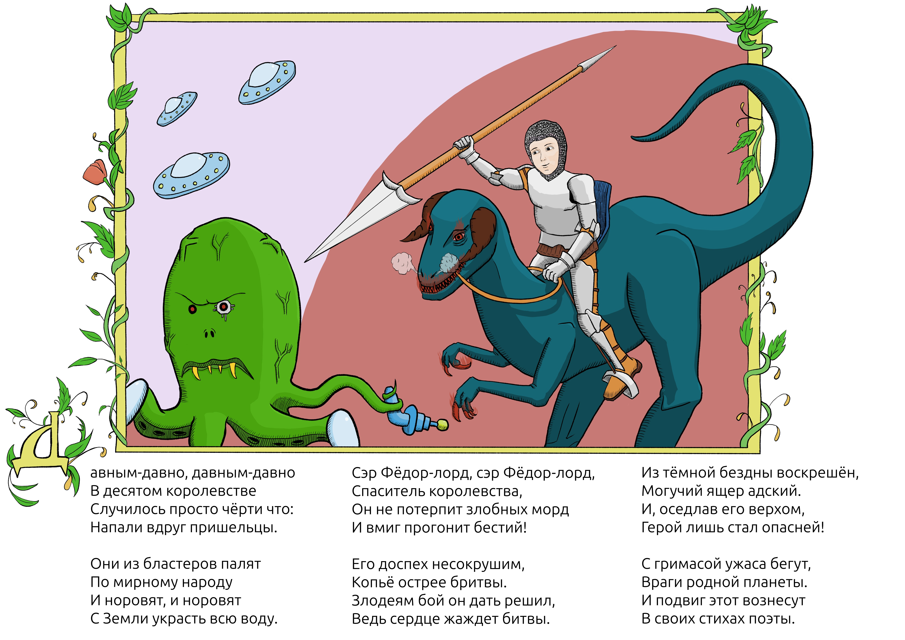

Давным-давно, давным-давно
В десятом королевстве
Случилось просто чёрти что:
Напали вдруг пришельцы.

Они из бластеров палят
По мирному народу
И норовят, и норовят
С Земли украсть всю воду.

Сэр Фёдор-лорд, сэр Фёдор-лорд,
Спаситель королевства,
Он не потерпит злобных морд
И вмиг прогонит бестий!

Его доспех несокрушим,
Копьё острее бритвы.
Злодеям бой он дать решил,
Ведь сердце жаждет битвы.

Из тёмной бездны воскрешён,
Могучий ящер адский.
И, оседлав его верхом,
Герой лишь стал опасней!

С гримасой ужаса бегут,
Враги родной планеты.
И подвиг этот вознесут
В своих стихах поэты.

